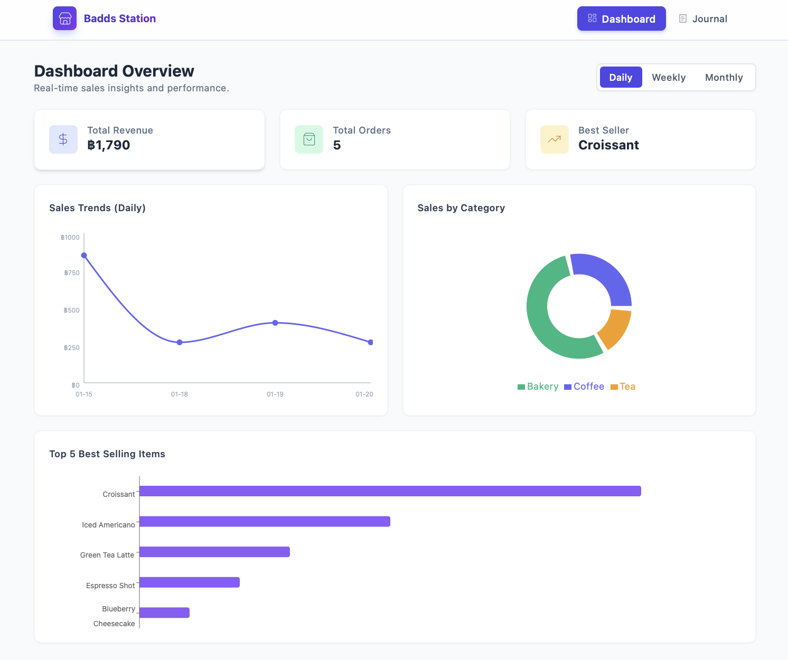
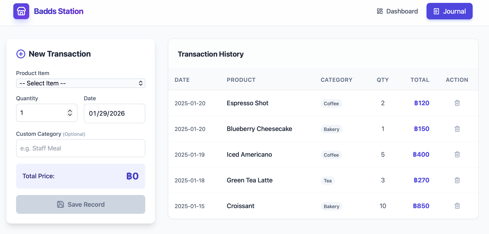
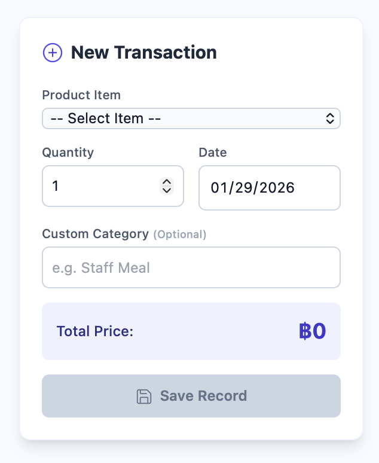
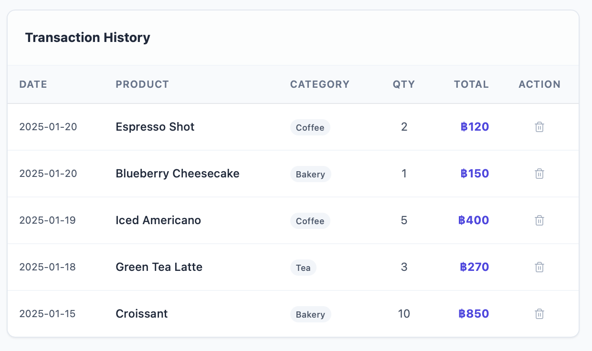
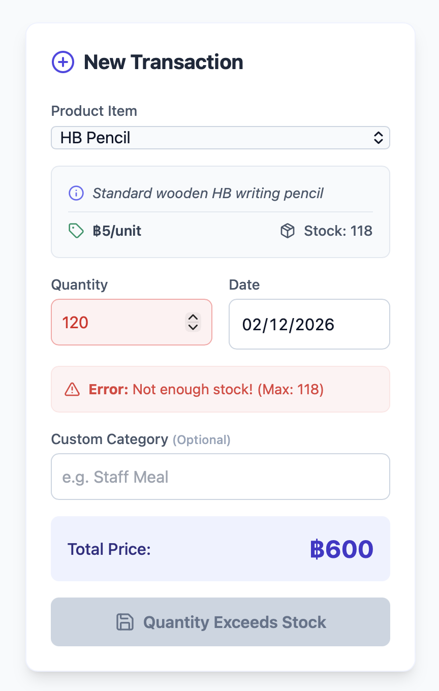

# Project 01: Basic POS (Point of Sale)

## Team Members
* Name:Pyae Zin Phyo ID:6715150

## Live Demo
[Click here to visit the live website](https://megalad.github.io/POS/)

## ✨ Features
- [x] **Dashboard:** Visualizes sales data with Line, Pie, and Bar charts.
- [x] **Sales Journal:** Records transactions with product selection and date.
- [x] **Inventory Management:** Prevents selling items that are out of stock.
- [x] **Custom Categories:** Allows users to type in new categories (e.g., "Staff Meal").
- [x] **Data Persistence:** Uses LocalStorage so data is saved after refresh.
- [x] **Responsive Design:** Works on different screen sizes with a modern UI.

## 📸 Screenshots

### Dashboard

*Displays Sales Trends (Line), Categories (Pie), and Top Items (Bar).*

### Sales Journal

*Allows recording transactions and adding custom categories.*

### Key Features
**New Transaction Form**

*Features real-time inventory checking and auto-calculated totals.*

**Transaction History**

*A clear list of all past sales with the ability to delete records.*

**Additional UI Design**

*Showcasing the responsive design, glassmorphism effects, and custom alerts.*

## 🛠 Technologies
* React + Vite
* Tailwind CSS
* Recharts (Data Visualization)
* Lucide React (Icons)
* LocalStorage (Data Persistence)
